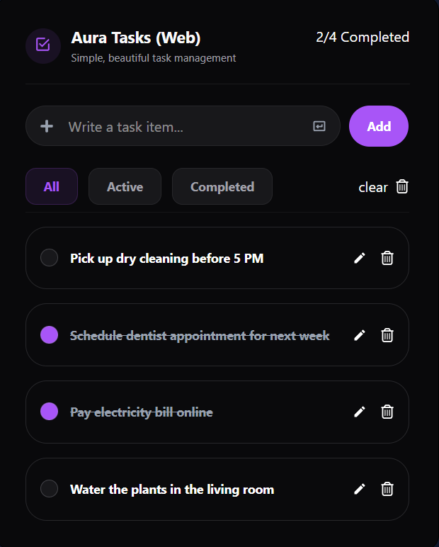

# Aura Tasks

A modern and beautiful task management application built with React, TypeScript, and Tailwind CSS.

## Features

- Add new tasks
- Edit existing tasks
- Delete tasks
- Mark tasks as completed
- Filter tasks by status (All / Active / Completed)
- Save tasks using Local Storage
- Keyboard shortcuts support
  - Press Enter to add or save tasks
  - Press Escape to cancel editing
- Responsive and clean UI

## Technologies Used

- React
- TypeScript
- Tailwind CSS
- Vite
- NanoID
- React Icons

## Installation

Clone the repository:

```bash
git clone YOUR_REPOSITORY_LINK
```

Go to the project folder:

```bash
cd aura-tasks
```

Install dependencies:

```bash
npm install
```

Start the development server:

```bash
npm run dev
```

## Usage

- Type a task and press Enter or click Add
- Use the edit button to modify tasks
- Mark tasks as completed using the checkbox
- Filter tasks using the status buttons
- Clear all tasks using the clear button

## Screenshots



## Live Demo

https://todo-app-mocha-zeta-69.vercel.app
